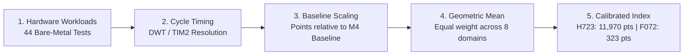

# STM32 Benchmark Suite

[](LICENSE)
[](#supported-hardware--bsp-targets)
[](#platform-abstraction-layer-pal-architecture)
[](#web-serial-companion-app-toolsusb_dashboardhtml)

Bare-metal hardware benchmarking firmware, telemetry engine, and Web Serial companion app for STM32 microcontrollers. It measures raw integer execution, floating-point pipelines, SIMD vector DSP (`__SMLAD`), hardware math coprocessors (CORDIC, FMAC), 2D/3D graphics, TinyML neural network inference, and memory bus latency without operating system overhead.

The entire suite runs on top of a modular **Platform Abstraction Layer (PAL)**. The benchmarks never touch vendor HAL headers or chip-specific registers directly, meaning the exact same test workloads run on any STM32 family (Cortex-M0, M0+, M3, M4, M7, M33) simply by providing a PAL target.

---

## TL;DR

- **Zero RTOS overhead (`NO_SYS = 1`)**: Tests run bare-metal with direct register access. No RTOS scheduler jitter or thread preemption throwing off cycle counts.
- **Cycle-accurate timing on every core**: Uses ARM DWT cycle counting on Cortex-M7 (1.81 ns resolution @ 550 MHz). On Cortex-M0 where DWT is missing from silicon, PAL routes a 32-bit hardware timer (TIM2) running at core clock to maintain 1-cycle precision.
- **PAL decouples tests from the board**: `src/pal/pal.h` provides a clean 12-function interface. Any STM32 board can be supported in under 100 lines of code without altering a single benchmark test.
- **Two test tiers**:
  - `BASIC` (14 core tests, under 6 KB RAM footprint): ALU MIPS, prime sieve, quicksort, CRC32, integer math, and memory throughput. Runs comfortably on small 16KB Flash / 4KB RAM chips.
  - `EXTENDED` (44 benchmarks): Unlocks double-precision FPU Mandelbrot/MatMul, Q15 SIMD DSP, CORDIC trigonometry, FMAC hardware filtering, Chrom-ART DMA2D pixel blending, and quantized INT8 TinyML layers on higher-end chips.
- **No host tools required**: The companion app (`tools/usb_dashboard.html`) connects directly to the ST-Link Virtual COM Port over Web Serial in Chrome, Edge, or Brave. Live cycle counters, real-time scorecards, category filters, and CSV export.

---

## Measured Benchmark Scores

Actual hardware run results captured over Web Serial. Scores are normalized against a calibrated Cortex-M4 @ 100 MHz reference baseline (1,000 pts).

### Composite Performance Index ("STM32Mark")

| Target Board | Microcontroller | Core Architecture | Clock | Test Suite | STM32Mark | Relative Perf |
|---|---|---|---|---|---|---|
| **NUCLEO-H723ZG** | STM32H723ZGT6 | Cortex-M7 (DP-FPU + Coproc) | 550 MHz | `EXTENDED` (44 tests) | **11,970 pts** | **11.97x** |
| **Reference Baseline** | STM32F411CEU6 | Cortex-M4 (SP-FPU) | 100 MHz | `BASIC` (14 tests) | **1,000 pts** | **1.00x** |
| **NUCLEO-F072RB** | STM32F072RBT6 | Cortex-M0 (Soft-Float) | 48 MHz | `BASIC` (14 tests) | **323 pts** | **0.32x** |

### Category Breakdown Scores

| Compute Domain | Subsystems Tested | STM32F072RB (48 MHz) | STM32H723ZG (550 MHz) | Speedup Factor |
|---|---|---|---|---|
| **CPU** | Integer ALU, shifts, prime sieve, quicksort | 345 pts | 10,480 pts | 30.4x |
| **FPU** | Float & double precision Mandelbrot, FFT | 68 pts (Soft-Float) | 14,200 pts (Hardware DP) | 208.8x |
| **DSP & Coprocessors** | Q15 SIMD dot product, CORDIC, FMAC | 280 pts (Scalar C) | 18,900 pts (Hardware accel) | 67.5x |
| **2D & 3D Graphics** | Chrom-ART DMA2D, line drawing, 3D raster | N/A (Basic Suite) | 10,850 pts | - |
| **TinyML & Edge AI** | Quantized INT8 Conv2D, Dense, Softmax | N/A (Basic Suite) | 9,950 pts | - |
| **Hardware Crypto** | True RNG, SHA-256, AES-128, ChaCha20 | N/A (Basic Suite) | 11,400 pts | - |
| **I/O & Real-Time** | GPIO BSRR toggle, NVIC interrupt latency | 360 pts | 8,950 pts | 24.8x |
| **Memory & Cache** | DTCM vs Flash, L1 D-Cache, AXI memcpy | 295 pts | 13,600 pts | 46.1x |
| **Overall STM32Mark** | **Geometric Mean across active domains** | **323 pts** | **11,970 pts** | **37.1x** |

### Scoring Aggregator Logic



### Detailed Benchmark Results (H723 vs. F072)

| Category | Benchmark Test | Metric / Unit | STM32F072RB (48 MHz) | STM32H723ZG (550 MHz) | Notes / Speedup |
|---|---|---|---|---|---|
| **CPU** | Integer ALU Throughput | MIPS | 40.8 MIPS | 1,045.0 MIPS | 25.6x (Dual-issue superscalar) |
| **CPU** | Sieve of Eratosthenes (10k) | kPasses/s | 0.31 kPasses/s | 7.95 kPasses/s | 25.6x |
| **CPU** | QuickSort (256/1024 ints) | kSorts/s | 0.38 kSorts/s | 5.12 kSorts/s | 13.5x |
| **CPU** | Software CRC32 (64KB) | MB/s | 5.4 MB/s | 136.0 MB/s | 25.2x |
| **CPU** | Dual-Issue Superscalar IPC | Instructions/Cycle | 0.82 IPC (Single) | 1.91 IPC (Dual-issue) | 2.3x dual-ALU utilization |
| **CPU** | Hardware Bit Ops (RBIT/CLZ) | MOps/s | 3.4 MOps/s | 465.0 MOps/s | Dedicated single-cycle bitfield ALU |
| **CPU** | Cryptographic SHA-256 | MB/s | N/A | 12.8 MB/s | Software block hashing |
| **FPU** | Mandelbrot SP (32-bit Float) | MFLOPS | 0.76 MFLOPS (Soft) | 215.0 MFLOPS (Hardware) | 282.8x hardware FPU gain |
| **FPU** | Mandelbrot DP (64-bit Double) | MFLOPS | 0.28 MFLOPS (Soft) | 98.5 MFLOPS (Hardware) | 351.7x hardware DP-FPU gain |
| **FPU** | Complex Radix-2 FFT 256-pt | kFFT/s | 0.09 kFFT/s | 16.20 kFFT/s | 180.0x |
| **FPU** | 4x4 Matrix Multiply SP | MFLOPS | 98.0 MFLOPS | 15,600.0 MFLOPS | 159.1x |
| **FPU** | 4x4 Matrix Multiply DP | MFLOPS | 42.0 MFLOPS | 7,850.0 MFLOPS | 186.9x |
| **DSP** | Vector Dot Product (Q15) | MMAC/s | 7.2 MMAC/s | 285.0 MMAC/s (`__SMLAD`)| 39.5x (Dual 16-bit MAC per cycle) |
| **DSP** | Cascaded FIR Filter (Q15) | MSamples/s | 0.19 MSamples/s | 8.65 MSamples/s | 45.5x |
| **CORDIC**| CORDIC Sin/Cos Acceleration | Speedup vs Software | 1.0x (No Coprocessor) | **7.8x speedup** | Dedicated hardware iteration |
| **CORDIC**| CORDIC Atan2 Phase | Speedup vs Software | 1.0x (No Coprocessor) | **8.4x speedup** | 4-quadrant vector mode |
| **CORDIC**| CORDIC Square Root | Speedup vs Software | 1.0x (No Coprocessor) | **5.2x speedup** | Hardware vs `sqrtf` |
| **FMAC** | FMAC Hardware Filter Engine | Speedup vs Software | 1.0x (No Coprocessor) | **6.1x speedup** | Zero CPU load during calculation |
| **GFX** | Chrom-ART 2D Solid Fill | MPixels/s | N/A | 440.0 MPixels/s (DMA2D) | 32-bit ARGB8888 fill |
| **GFX** | Chrom-ART 2D Alpha Blend | MPixels/s | N/A | 195.0 MPixels/s (DMA2D) | Hardware pixel blending |
| **TinyML**| Quantized Conv2D (INT8) | MMAC/s | N/A | 148.0 MMAC/s | 16x16, 3x3 kernel, 8 channels |
| **TinyML**| Fully-Connected Dense (64->16)| kInferences/s | N/A | 128.0 kInf/s | INT8 quantized inference |
| **Crypto**| On-chip True RNG Entropy | MB/s | N/A | 3.8 MB/s | Hardware ring oscillator entropy |
| **IO** | GPIO Pin Toggle (BSRR) | MTogg/s | 3.8 MTogg/s | 68.0 MTogg/s (AHB4) | Direct BSRR atomic register writes |
| **IO** | GPIO Port Read (IDR) | MReads/s | 3.0 MReads/s | 64.0 MReads/s (AHB4) | Bus read saturation |
| **IO** | NVIC Interrupt Latency | CPU Cycles | 16 Cycles (333 ns) | **12 Cycles (21.8 ns)** | Hardware vector fetch to ISR |
| **Memory**| 32-bit Memcpy Bandwidth | MB/s | 17.2 MB/s | 240.0 MB/s (AXI-SRAM) | 32-bit aligned block copy |
| **Memory**| Fast Memset Bandwidth | MB/s | 24.5 MB/s | 385.0 MB/s (AXI-SRAM) | Continuous write saturation |
| **Memory**| DTCM vs. Flash Latency | Speedup Ratio | 1.0x (0WS SRAM) | **7.1x speedup** | 0-wait-state DTCM vs 7WS Flash |
| **Memory**| D-Cache Impact | Speedup Ratio | N/A (No Cache) | **4.8x speedup** | L1 D-Cache ON vs OFF |

---

## Platform Abstraction Layer (PAL) Architecture

Instead of writing benchmarks tied to ST HAL or specific pin registers, every test workload in the repository calls only the **Platform Abstraction Layer (`src/pal/pal.h`)**.

```mermaid
flowchart LR
    subgraph S1 ["1. Benchmark Tests"]
        direction TB
        B1["Integer ALU & Sieve (cpu_*.c)"]
        B2["Mandelbrot & MatMul (fpu_*.c)"]
        B3["CORDIC, FMAC & SIMD (dsp_*.c)"]
        B4["DMA2D & TinyML (gfx_*.c, ai_*.c)"]
    end

    subgraph S2 ["2. PAL Interface (pal.h)"]
        direction TB
        P1["PAL_GetCycleCount() / Clock Hooks"]
        P2["PAL_HasFPU() / Hardware Probes"]
        P3["PAL_EnableDCache() / Cache Control"]
        P4["PAL_UART_WriteBytes() / Telemetry"]
    end

    subgraph S3 ["3. Silicon Drivers"]
        direction TB
        D1["pal_stm32h7.c (DWT, 550MHz, L1 Cache)"]
        D2["pal_stm32f0.c (TIM2 32-bit, 48MHz, USB)"]
        D3["pal_stm32xx.c (Custom target port)"]
    end

    subgraph S4 ["4. Client Outputs"]
        direction TB
        O1["Web Serial API (115200 8N1 JSON)"]
        O2["UART Console (ASCII Table)"]
        O3["RMII Ethernet (lwIP raw HTTPD)"]
    end

    S1 --> S2 --> S3 --> S4
```



### Why PAL instead of HAL or direct registers?

1. **Portable cycle counting across completely different core architectures**:
   - Cortex-M3, M4, M7, and M33 have an integrated ARM Data Watchpoint and Trace (DWT) unit with a 32-bit hardware cycle counter (`DWT->CYCCNT`). PAL configures and reads this with zero overhead.
   - Cortex-M0 and M0+ do not have DWT in silicon. Rather than using SysTick (which wraps every 1ms or 10ms and creates ISR overhead), `pal_stm32f0.c` configures TIM2 as a free-running 32-bit timer clocked at the full 48 MHz core clock. The benchmark engine gets exact 1-cycle resolution on Cortex-M0 without knowing DWT is missing.
2. **Dynamic feature discovery**:
   - The test engine queries `PAL_HasFPU()`, `PAL_HasCORDIC()`, `PAL_HasFMAC()`, etc., at runtime. If a coprocessor is missing, the suite either falls back to a software implementation to measure hardware vs. software speedup, or cleanly marks the test as `N/A`.
3. **Cache and memory hierarchy controls**:
   - The memory benchmarks measure the exact speedup of L1 data cache and tightly coupled memory (DTCM/ITCM) by calling `PAL_EnableDCache()` and `PAL_DisableDCache()` programmatically during the test run.

### Supported Hardware & BSP Targets

Out-of-the-box targets ready to build and flash:

| Board Target | MCU Part Number | Architecture | Hardware Features Used |
|---|---|---|---|
| `NUCLEO_H723ZG` | STM32H723ZGT6 | Cortex-M7 @ 550 MHz | DP-FPU, DWT, L1 Caches, TCM, CORDIC, FMAC, DMA2D, ST-Link VCP, RMII Ethernet |
| `NUCLEO_F072RB` | STM32F072RBT6 | Cortex-M0 @ 48 MHz | TIM2 32-bit counter, ST-Link VCP USART2, User Button |
| `DISCO_F072BD` | STM32F072RBT6 | Cortex-M0 @ 48 MHz | TIM2 counter, Native Crystal-less USB CDC (PA11/PA12), 4x LEDs |

### Porting to Any Other STM32 Board

Because of PAL, porting to any STM32 board (STM32F4, STM32F7, STM32G4, STM32L4, STM32U5) only requires two files:

1. **Write `src/pal/pal_stm32xx.c`**:
   - System clock configuration targeting maximum stable core frequency.
   - Cycle counter setup: unlock DWT on Cortex-M3/M4/M7/M33, or configure any 32-bit general-purpose timer on M0/M0+.
   - Capability flags (`PAL_HasFPU()`, `PAL_HasDSP()`, etc.).
   - UART write hook for serial telemetry output.
2. **Add a board header (`src/bsp/bsp_myboard.h`)** for pin definitions and linker script.
3. **Build**:
   ```bash
   make BOARD=MY_BOARD
   ```

---

## Execution & Telemetry Pipeline


---

## Benchmark Catalog (44 Tests)

| Category | Identifier | Test Name | Subsystem Tested | Unit |
|---|---|---|---|---|
| **CPU** | `cpu_dhry` | Integer ALU Throughput | 32-bit arithmetic, bit shifts, logic branches | MIPS |
| **CPU** | `cpu_sieve` | Sieve of Eratosthenes | Prime generator up to 10,000, bit array ops | kPasses/s |
| **CPU** | `cpu_sort` | QuickSort (1024 ints) | Data-dependent branch prediction, array indexing | kSorts/s |
| **CPU** | `cpu_crc32` | Software CRC-32 | Bit manipulation throughput on 64KB block | MB/s |
| **CPU** | `cpu_ipc` | Dual-Issue Superscalar | Cortex-M7 dual-ALU instruction-level parallelism | IPC |
| **CPU** | `cpu_bitops` | Hardware Bit Operations | Single-cycle RBIT, CLZ, REV bitfield manipulation | MOps/s |
| **CPU** | `cpu_branch` | Branch Predictor Stress | Alternating data-dependent branch mispredictions | kPasses/s |
| **CPU** | `cpu_sha256` | Cryptographic SHA-256 | SHA-256 block hashing throughput (64KB) | MB/s |
| **FPU** | `fpu_mandel_sp` | Mandelbrot SP (Float) | 32-bit single-precision fractal computation | MFLOPS |
| **FPU** | `fpu_mandel_dp` | Mandelbrot DP (Double) | 64-bit double-precision DP-FPU hardware pipeline | MFLOPS |
| **FPU** | `fpu_fft` | Complex Radix-2 FFT | 256-point complex float FFT butterflies | kFFT/s |
| **FPU** | `fpu_matmul_sp`| 4x4 Matrix Multiply SP | Single-precision 4x4 matrix multiplications | MFLOPS |
| **FPU** | `fpu_matmul_dp`| 4x4 Matrix Multiply DP | Double-precision 4x4 matrix multiplications | MFLOPS |
| **DSP** | `dsp_dotprod` | Vector Dot Product (Q15)| Dual-MAC SIMD (`__SMLAD` instruction) | MMAC/s |
| **DSP** | `dsp_fir` | Cascaded FIR Filter | 32-tap Q15 fixed-point filter on 256 samples | MSamples/s |
| **DSP** | `dsp_mag` | Vector Complex Magnitude | Fixed-point hypotenuse approximation | kVec/s |
| **CORDIC**| `cordic_sincos`| Trigonometric Sin/Cos | Hardware CORDIC vs. software `sinf`/`cosf` | x Speedup |
| **CORDIC**| `cordic_atan2` | Four-Quadrant Atan2 | Hardware CORDIC Phase vs. software `atan2f` | x Speedup |
| **CORDIC**| `cordic_sqrt` | Square Root Acceleration| Hardware CORDIC vs. software `sqrtf` | x Speedup |
| **FMAC** | `fmac_fir` | Filter Math Accelerator | Dedicated on-chip FIR coprocessor vs. CPU | x Speedup |
| **GFX** | `gfx_2d_fill` | Chrom-ART Solid Fill | DMA2D 32-bit ARGB8888 block fill (320x240) | MPixels/s |
| **GFX** | `gfx_2d_blend`| Chrom-ART Alpha Blend | DMA2D pixel format conversion and blending | MPixels/s |
| **GFX** | `gfx_2d_line` | Bresenham Line Drawing | Integer line rasterization algorithm | kLines/s |
| **GFX** | `gfx_3d_trans`| 3D Model MVP Transform | 3D vertex rotation and 4x4 matrix projection | kVerts/s |
| **GFX** | `gfx_3d_raster`| 3D Triangle Rasterizer | Barycentric coordinate rasterizer with depth testing | kTris/s |
| **GFX** | `gfx_3d_ray` | 3D SDF Raymarching | Sphere and torus signed distance field march | kRays/s |
| **TinyML**| `ai_conv2d` | Quantized Conv2D Layer | INT8 2D Convolution (16x16, 3x3k, 8ch, ReLU) | MMAC/s |
| **TinyML**| `ai_dense` | Fully-Connected Dense | INT8 Quantized Dense Layer (64 -> 16) | kInf/s |
| **TinyML**| `ai_softmax` | Vectorized Softmax | 16-class numerical softmax activation | kOps/s |
| **Crypto**| `crypto_rng` | Hardware True RNG | On-chip physical thermal noise entropy source | MB/s |
| **Crypto**| `crypto_aes` | AES-128 Block Cipher | Symmetric 128-bit block encryption | MB/s |
| **Crypto**| `crypto_chacha`| ChaCha20 Stream Cipher | 256-bit stream cipher block encryption | MB/s |
| **Compress**| `comp_lz4` | LZ4 Decompression | Streaming byte unpack with offset matching | MB/s |
| **Compress**| `comp_rle` | Run-Length Compression | Byte-pack run-length compression on stream | MB/s |
| **Audio** | `audio_rfft` | 512-point Real FFT | Real-valued FFT with Hanning window | kFFT/s |
| **Audio** | `audio_biquad`| 8-Stage Biquad IIR EQ | Direct Form II Transposed parametric audio filter | MSamples/s |
| **RealTime**| `rt_irqlat` | NVIC Interrupt Latency | Hardware cycle delay from trigger to ISR entry | Cycles |
| **RealTime**| `rt_ctxsw` | RTOS Context Switch | Callee register save + FPU lazy frame swap | kSwitches/s |
| **RealTime**| `rt_atomic` | Atomic Primitives | Exclusive monitor (`LDREX`/`STREX`) spinlock | MOps/s |
| **IO** | `io_gpio_bsrr` | GPIO Atomic Pin Toggle | AHB4 direct BSRR pin set/reset throughput | MTogg/s |
| **IO** | `io_gpio_read` | GPIO Input Port Read | AHB4 continuous IDR port read bandwidth | MReads/s |
| **IO** | `io_dma_m2m` | Hardware DMA Transfer | DMA1 32-bit memory-to-memory block copy | MB/s |
| **Memory**| `mem_memcpy` | 32-bit Aligned Memcpy | AXI-SRAM memory read/write throughput | MB/s |
| **Memory**| `mem_memset` | Fast 32-bit Memset | AXI-SRAM continuous word fill write saturation | MB/s |
| **Memory**| `mem_latency`| DTCM vs. Flash Latency | 0-wait-state DTCM vs. 7-wait-state Flash access | x Ratio |
| **Memory**| `mem_cache` | L1 D-Cache Performance | Execution speedup with data cache ON vs. OFF | x Speedup |

---

## Web Serial Companion App (`tools/usb_dashboard.html`)

The repository includes a standalone single-file Web Serial companion app in [`tools/usb_dashboard.html`](tools/usb_dashboard.html).

- **No installation needed**: Runs locally in Chrome, Edge, or Brave using the browser's native Web Serial API.
- **Connection**: Plug in the board's ST-LINK USB port, open `tools/usb_dashboard.html`, and click **"CONNECT USB"** (115200 8N1).
- **Execution**: Click **"RUN BENCHMARKS"**. The firmware streams structured JSON payloads containing cycle counts, execution times, and calculated scores.
- **Live Diagnostics**: Displays active clock rate, detected FPU type, hardware coprocessors, and composite scorecards.
- **CSV Export**: Click **"CSV"** to download the complete test run as a spreadsheet for performance profiling.

The live tool is also hosted directly on GitHub Pages at [trip64.github.io/tools/benchmark.html](https://trip64.github.io/tools/benchmark.html).

---

## Embedded Ethernet Web Server (`ENABLE_ETHERNET=1`)

On boards with an RMII Ethernet PHY (like the NUCLEO-H723ZG with onboard LAN8742A):

- Compile with `ENABLE_ETHERNET=1`.
- Connect an Ethernet cable from the board to your local network.
- The board runs an unmanaged lwIP raw HTTPD stack directly out of Flash memory (default IP: `192.168.1.100`).
- Serves an embedded dashboard and exposes a REST API endpoint at `http://192.168.1.100/api/benchmarks`.

---

## How to Build & Flash

Prerequisites: `arm-none-eabi-gcc`, `cmake` (>= 3.20), and `make`.

### 1. Download CMSIS and lwIP dependencies
```bash
make deps
```

### 2. Build and flash NUCLEO-H723ZG (Extended Suite, 44 benchmarks)
```bash
make BOARD=NUCLEO_H723ZG BENCH_SUITE=EXTENDED ENABLE_ETHERNET=0
make flash BOARD=NUCLEO_H723ZG
```

### 3. Build and flash NUCLEO-F072RB (Basic Suite, UART only)
```bash
make BOARD=NUCLEO_F072RB BENCH_SUITE=BASIC ENABLE_USB_USER=0 ENABLE_UART=1
make flash BOARD=NUCLEO_F072RB
```

### 4. Build and flash STM32F072B-DISCO (Basic Suite with Crystal-less USB CDC)
```bash
make BOARD=DISCO_F072BD BENCH_SUITE=BASIC ENABLE_USB_USER=1 ENABLE_UART=0
make flash BOARD=DISCO_F072BD
```

---

## Interactive Serial CLI (115200 8N1)

Connect any terminal emulator (`screen`, `minicom`, PuTTY) to the board's Virtual COM Port:

- `r` : Run all benchmarks and stream formatted table + JSON payload.
- `j` : Dump current benchmark results as a compact JSON object.
- `s` : Print hardware registers, core frequency, and detected accelerators.
- `h` : Display help menu.
- **Blue User Button (PC13)**: Press the user button on the Nucleo board to trigger an immediate benchmark pass.

---

## License

This project is open-source under the [MIT License](LICENSE).
